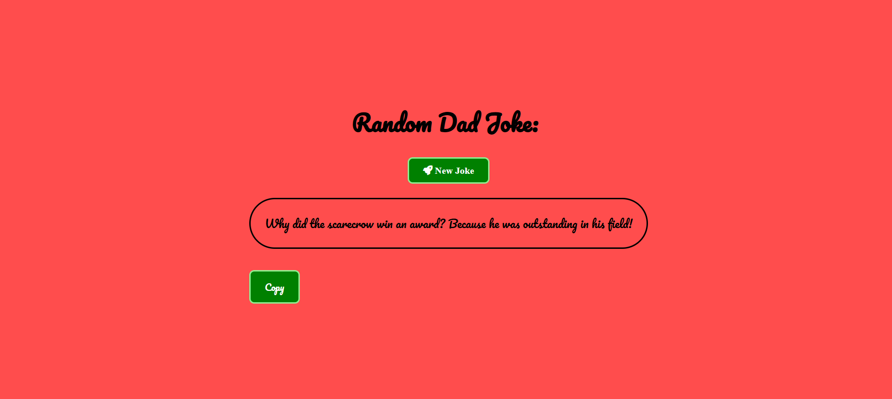

# 🎭 Random Dad Jokes Generator  
# Description
A fun web app that fetches and displays random dad jokes! Users can generate new jokes and copy them to the clipboard with a single click.  

## 🚀 Features  
- Fetches random dad jokes from [icanhazdadjoke API](https://icanhazdadjoke.com/)  
- Copy jokes to clipboard  
- Dynamic background color changes on joke refresh  
- Simple and responsive UI


## 📸 Screenshot  



[Project Codepen Link](https://codepen.io/DevOlabode/full/qEBmZbL)


## 🔧 Technologies Used  
- HTML  
- CSS  
- JavaScript  
- [Axios](https://github.com/axios/axios) (for API requests)  

## 📂 Installation  
1. Clone the repository:  
   ```sh  
   git clone https://github.com/DevOlabode/Random-dad-joke-generator.git  
   ```  
2. Open `index.html` in a browser.  

## 🤝 Contributing  
Feel free to submit issues or pull requests if you have improvements!  

## 📝 License  
This project is licensed under the MIT License.
